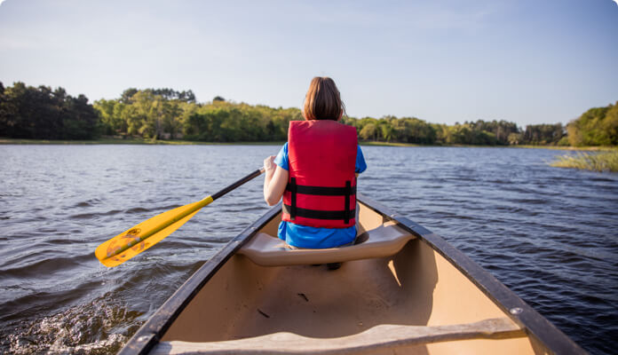

## Welcome!

This part of our site has information and resources to help you succeed and to help you understand how our district operates.

## Location

We are located in west Georgia, serving Scouts in Carroll, Douglas, and Haralson counties. We serve all ages of Scouts from all backgrounds. Scouting programs include Cub Scouts, Scouts BSA, Sea Scouts, Venturing, and Varsity Scouts. There is something for any youth from the first grade up to age 21.

Indian Springs is part of the [Atlanta Area Council](https://www.atlantabsa.org) of the Boy Scouts of America. You can see a listing of all the districts at [here](https://www.atlantabsa.org/districts).

### What's Happening

Check out our [Distric Calendar]( "Indian Springs District Calendar") to see what's happening.

### Lion

Lion is Scouting for kindergarten-age boys and girls.

[Learn More](https://beascout.scouting.org)

### Family Scouting

Family Scouting for Boy, Girls and Parents in Cub Scouts. Our priority is to bring the opportunity and benefits of Scouting to all youth.

[Learn More](https://beascout.scouting.org)

### Join Scouting

The BSA’s mission is to prepare young people to make ethical and moral choices over their lifetimes by instilling in them the values of the Scout Oath and Scout Law.

[Learn More](https://beascout.scouting.org)

### Quick links for units

- [Distric Calendar]()
- [Internet Recharter](https://scoutnet.scouting.org/ucrs/UI/home/default.aspx)
- [Scout Book](https://scoutbook.scouting.org)
- [Internet Advancement](https://advancements.scouting.org)
- [My.Scouting Login](https://my.scouting.org/)
